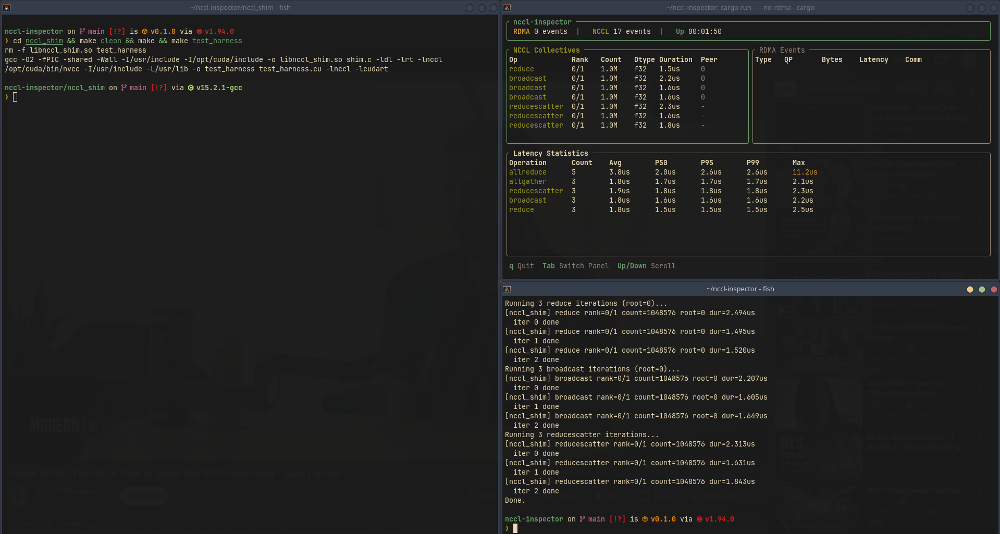
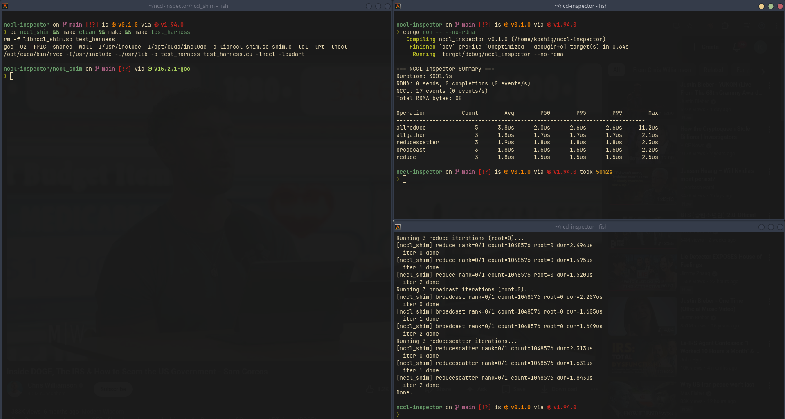
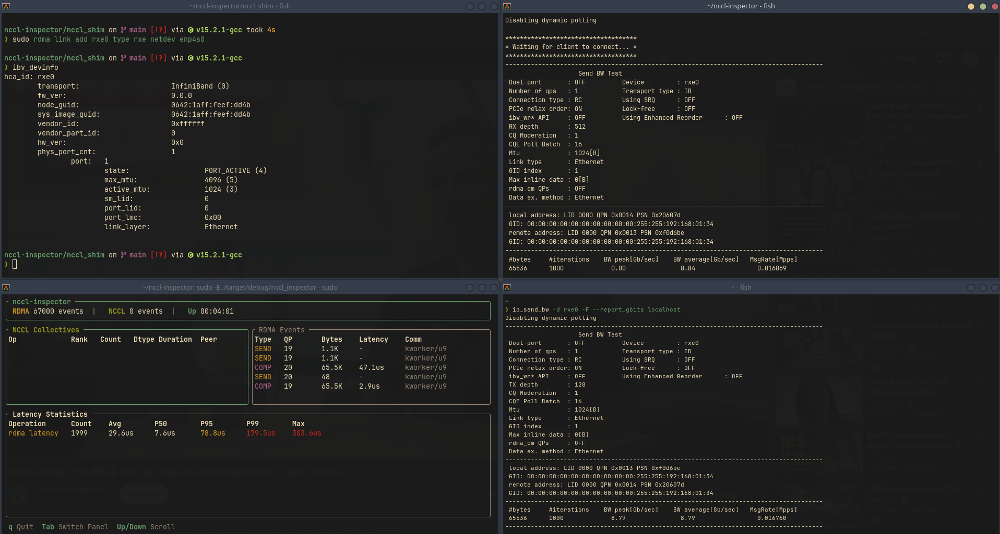

# nccl-inspector

Real-time performance inspector for NCCL collectives and RDMA traffic. It gives you a live TUI showing every allreduce/broadcast/reducescatter as it happens, alongside the underlying RDMA send/completion events — with per-operation latency percentiles.

No kernel patches, no NCCL recompile. It attaches to a running workload from the outside.

---

## How it works

Two independent data streams, unified in one view:

**NCCL side** — a small C shim (`libnccl_shim.so`) intercepts NCCL calls via `LD_PRELOAD`. Before and after each collective, it records the operation type, rank, element count, datatype, and duration into a POSIX shared memory ring buffer (`/nccl_inspector`). The inspector process reads from that ring buffer continuously.

**RDMA side** — three eBPF kprobes on the soft-RoCE (`rxe`) kernel path: `rxe_post_send` (attributes each QP to its userspace owner), `rxe_xmit_packet` (records outbound sends and timestamps), and `rxe_cq_post` (records completions and computes round-trip latency). Events are delivered via a BPF ring buffer. Requires root.

Both streams use `CLOCK_MONOTONIC` so timestamps are directly comparable for correlation.

The TUI is built in Rust with [ratatui](https://github.com/ratatui-org/ratatui). The eBPF skeleton is generated at build time via `libbpf-cargo`.

```
┌─────────────────────────────────────────────────────────┐
│  Your NCCL workload                                      │
│  LD_PRELOAD=libnccl_shim.so ./my_training_job           │
│         │                                               │
│         ▼                                               │
│  /nccl_inspector  (POSIX shm ring buffer)               │
│         │                                               │
│         ▼                          eBPF kprobes         │
│  nccl-inspector (Rust)  ◄──────────rxe_xmit_packet      │
│         │                          rxe_cq_post          │
│         ▼                          rxe_post_send        │
│  ratatui TUI                                            │
└─────────────────────────────────────────────────────────┘
```

---

## Requirements

- Linux kernel 5.15+ (eBPF CO-RE, soft-RoCE support)
- Rust + Cargo
- CUDA toolkit (for building the shim and test harness)
- NCCL installed (`libnccl.so` on the library path)
- `clang` and kernel headers (for eBPF compilation)
- Root for RDMA tracing (pass `--no-rdma` to skip)

---

## Build

```bash
# Build the NCCL shim and test harness
cd nccl_shim
make clean && make

# Build the inspector
cd ..
cargo build
```

---

## Run

**Step 1 — start the inspector** (in one terminal):

```bash
# With RDMA tracing (requires root)
sudo ./target/debug/nccl_inspector

# Without RDMA (no root needed)
./target/debug/nccl_inspector --no-rdma

# Headless, run for 60 seconds then print summary
sudo ./target/debug/nccl_inspector --format plain --duration 60

# JSON output for piping
sudo ./target/debug/nccl_inspector --format json
```

**Step 2 — run your NCCL workload** with the shim preloaded (in another terminal):

```bash
LD_PRELOAD=/path/to/nccl_shim/libnccl_shim.so ./your_nccl_program
```

Or use the included test harness:

```bash
cd nccl_shim
LD_PRELOAD=./libnccl_shim.so ./test_harness
```

**TUI keybindings:**

| Key | Action |
|-----|--------|
| `Tab` | Switch between NCCL and RDMA panels |
| `↑` / `↓` | Scroll event list |
| `q` / `Ctrl+C` | Quit |

---

## Demo

### Live TUI — NCCL collectives + latency stats

The left panel shows incoming NCCL collectives (op, rank, count, dtype, duration). The right panel shows RDMA events when running with RDMA tracing. The bottom table updates live with P50/P95/P99/max per operation type.



### Summary output after a run

When the inspector exits (or `--duration` elapses), it prints an aggregate summary with counts and latency percentiles across the full session.



### RDMA tracing with ib_send_bw

Running `ib_send_bw` against a soft-RoCE loopback device while the inspector is attached. The RDMA panel fills in with SEND and COMP events, latency statistics, and QP/peer attribution.



---

## Project structure

```
nccl-inspector/
├── src/
│   ├── main.rs          # CLI, eBPF setup, event loop
│   ├── app.rs           # Shared state, latency stats
│   ├── tui.rs           # ratatui rendering
│   ├── nccl/mod.rs      # Shared memory reader
│   └── bpf/
│       └── rdma_probe.bpf.c   # eBPF probes (rxe kprobes)
└── nccl_shim/
    ├── shim.c           # LD_PRELOAD intercept + shm writer
    ├── test_harness.cu  # Single-process NCCL test
    └── test_harness_mp.cu     # Multi-process NCCL test
```
